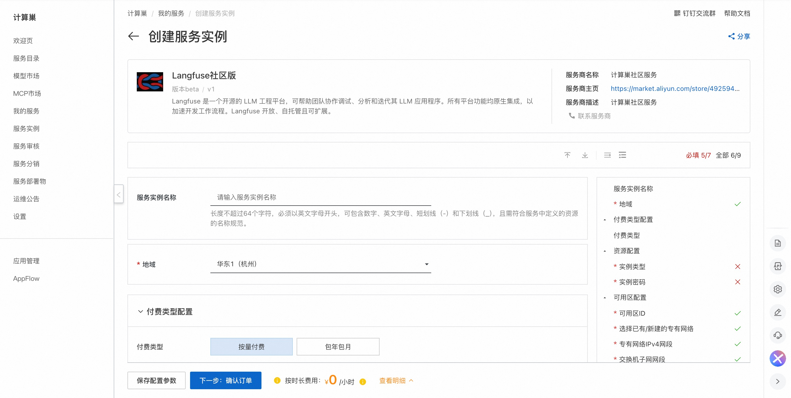
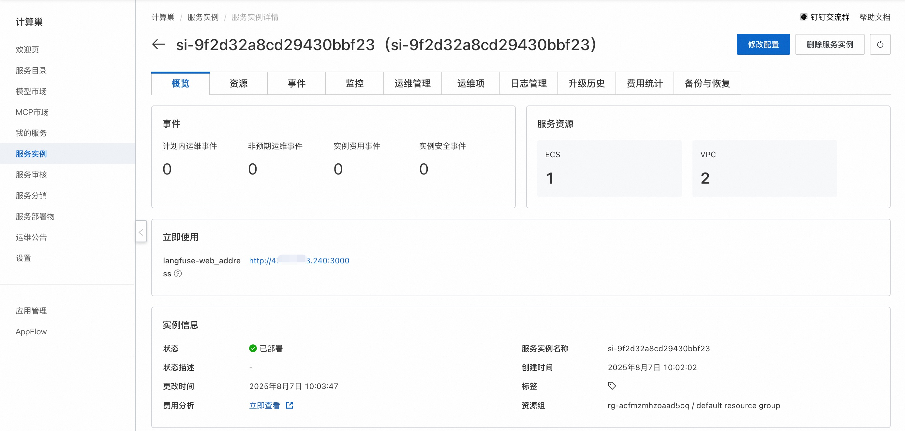
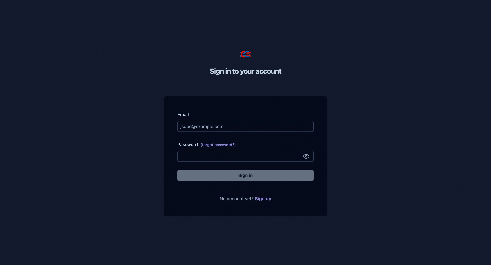

## 🌟 服务简介

Langfuse 是一个 开源 LLM 工程 平台。它帮助团队协作 开发、监控、评估 以及 调试 AI 应用。Langfuse 可在几分钟内 自托管，并且经过 实战考验。

### ✨ 核心特性

- LLM 应用可观察性：为你的应用插入仪表代码，并开始将追踪数据传送到 Langfuse，从而追踪 LLM 调用及应用中其他相关逻辑（如检索、嵌入或代理操作）。检查并调试复杂日志及用户会话。试试互动的 演示 看看效果。

- 提示管理 帮助你集中管理、版本控制并协作迭代提示。得益于服务器和客户端的高效缓存，你可以在不增加延迟的情况下反复迭代提示。

- 评估 是 LLM 应用开发流程的关键组成部分，Langfuse 能够满足你的多样需求。它支持 LLM 作为"裁判"、用户反馈收集、手动标注以及通过 API/SDK 实现自定义评估流程。

- 数据集 为评估你的 LLM 应用提供测试集和基准。它们支持持续改进、部署前测试、结构化实验、灵活评估，并能与 LangChain、LlamaIndex 等框架无缝整合。

- LLM 试玩平台 是用于测试和迭代提示及模型配置的工具，缩短反馈周期，加速开发。当你在追踪中发现异常结果时，可以直接跳转至试玩平台进行调整。

- 综合 API：Langfuse 常用于驱动定制化的 LLMOps 工作流程，同时利用 Langfuse 提供的构建模块和 API。我们提供 OpenAPI 规格、Postman 集合以及针对 Python 和 JS/TS 的类型化 SDK。

## 💰 计费说明

Langfuse社区版在计算巢部署的费用主要涉及：

- 所选vCPU与内存规格
- 系统盘类型及容量
- 公网带宽

## 🚀 部署流程

1. 访问计算巢Langfuse社区版[部署链接](https://computenest.console.aliyun.com/service/instance/create/cn-hangzhou?type=user&ServiceId=service-d88bae5082304ed9bfe9)
，按提示填写部署参数：
   

2. 参数填写完成后可以看到对应询价明细，确认参数后点击**下一步：确认订单**。

3. 确认订单完成后同意服务协议并点击**立即创建**进入部署阶段。

4. 等待部署完成后进入服务实例详情页。
   

5. 点击服务地址，注册账号并使用Langfuse社区版。
   

# 📚 使用指南

更多用法请参考Langfuse[官网文档](https://langfuse.com/docs)。